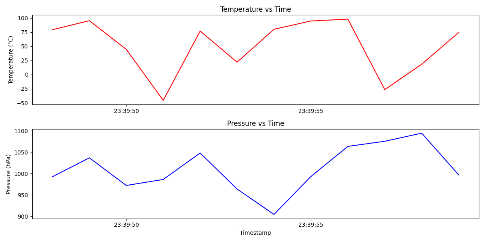

# OBDH Simulator

This project simulates a basic On-Board Data Handling (OBDH) system for a satellite. It generates, logs, and visualizes telemetry data such as temperature and pressure, mimicking a real spacecraft's internal data flow.

## Features

- Generates simulated telemetry data (temperature & pressure)
- Logs telemetry data to CSV
- Logs errors in a separate file
- Generates real-time telemetry plots
- Saves telemetry graphs for analysis

## Graph Preview

## Future Improvements

- Add more sensors (altitude, radiation, etc.)
- GUI for real-time data monitoring
- Integration with simulated ground station

## Built With

- Python
- Matplotlib
- CSV module

